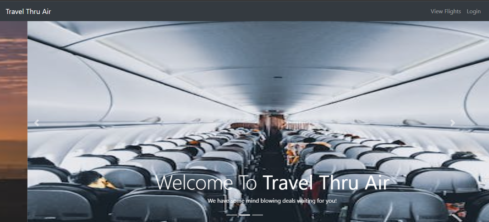

# FlightSystem
A website where users can view flights, view mindblowing deals on flights as well as filter flights from source to destination within a given time interval.
Admins have to login into the website where they can add flights, update flights and update deals/discount on flights.
This flight management system website is built using Java Servlets.

# UI of the Application
### Home Page
</img>

### SignIn
</img>

### View Flights
</img>

### Mindblowing Deals
</img>

### Applying Filter
</img>

### Flight List after applying Filter
</img>

### Admin page after successful signin
</img>

### Adding new flight
</img>
</img>
